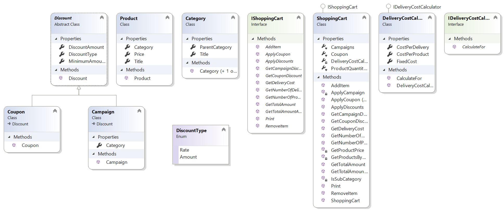

# Bussines
Bu projede iş mantığı yapısı yapılmıştır.

## Sınıf Diyagramı

## Sınıfların Açıklamaları
---

## Product Sınıfı

`Title` , `Price` ve `Category` bilgilerini barındıran bir sınıf.

## Category Sınıfı

`Title` ve `ParentCategory` bilgilerini barındıran bir sınıf. `ParentCategory` alanı ile başka bir `Category` sınıfına ait olup olmadığı bilgisi tutuluyor.

## Discount Soyut Sınıfı

Bu sınıf `Campaign` ve `Coupon` sınıflarının üs (Base) sınıfı olması için yaratılmıştır. Bu sınıf `DiscountAmount`, `DiscountType` ve `MinimumAmount` bilgileri tutulmaktadır. `MinimumAmount` bu indirimin gerçekleşmesi için gereken minumum niteliği göstermektedir. `DiscountAmount` yapılacak indirimin miktarını tutmaktadır. `DiscountType` belirtilen indirim miktarının oran ya da miktar tipinde olduğunu nitelendirmek için kullanılmıştır. Miras (inheritence) yapısıyla alt sınıflarına özelliklerini açmaktadır. Bu sayede kod tekrarından kaçınma sağlanmıştır.

## Coupon Sınıfı

`Discount` sınıfından miras alır. Üs (Base) sınıfıyla aynıdır. `Discount` sınıfının concrete bir uyarlamasıdır.

## Campaign Sınıfı

`Discount` sınıfından miras alır. Üs (Base) sınıfından farklı olarak `Category` bilgisi tutmaktadır. Bu sınıf oluşturulurken kullanılan yapıların büyük kısmı miras yoluyla `Discount` sınıfından gelmiştir. Bu sayede kod tekrarından kaçınılmıştır.

## DiscountType Enum

`Discount` sınıfında `DiscountType` bilgisinde kullanılmaktadır. Daha anlaşılabilir bir yapı oluşturduğu için kullanılmıştır.

## IDeliveryCostCalculator Arayüzü

Bu arayüz delivery cost calculator implementasyonları için yapı tanımlanması için kullanılmıştır. Bu yapı sayesinde genişletilebilir ve test edilebilir bir yapı kurulmuştur. `CalculateFor` methodu tanımlanmıştır. `CalculateFor` methodu için gereken shopping cart objesi içinde `IShoppingCart` arayüzü kullanılmıştır. Bu sayede bağımlılıklar zayıflatılmıştır ve değişimlere açık hale getirilmiştir.

## DeliveryCostCalculator Sınıfı

`IDeliveryCostCalculator` arayüzünü implement etmektedir. Arayüzün zorunlu kıldığı `CalculateFor(IShoppingCart cart)` methodunu implement etmiştir. `CostPerDelivery`, `CostPerProduct` ve `FixedCost` bilgilerini tutmaktadır buna göre hesaplama yapmaktadır.

## IShoppingCart Arayüzü

Bu arayüz shopping cart implementasyonları için yapı tanımlanması için kullanılmıştır. Bu sayede farklı şekilde shopping cart implementasyonlarına alt yapı sağlanmış oluyor. Uygulama içinde az değişiklik yapılarak uygulamanın genişlemesine olanak sağlamaktadır. 

## ShoppingCart Sınıfı

`IShoppingCart` arayüzünü implement etmektedir. Bu sınıfta constructor injection yöntemi kullanılmıştır. Bu sınıfın içinde ihtiyaç duyulan `DeliveryCostCalculator` sınıfı `IDeliveryCostCalculator` arayüzü ile polymorphism (çok biçimlilik) yapısı ile kullanılmıştır. Bu bağımlılık (dependency) constructor dan alınarak loosely-coupling (zayıf ilişki) kurulması sağlanmıştır. Bu zayıf ilişki sayesinde test edilebilir ve genişletilebilir bir yapı kurulmuştur.

Not: `InternalsVisibleTo("Trendyol.Tests")` sayesinde `internal ProductQuantities` data alanı test projesinden erişilebilir yapılmıştır. `AddItem` methodunu test ederken kullanabilmek için.